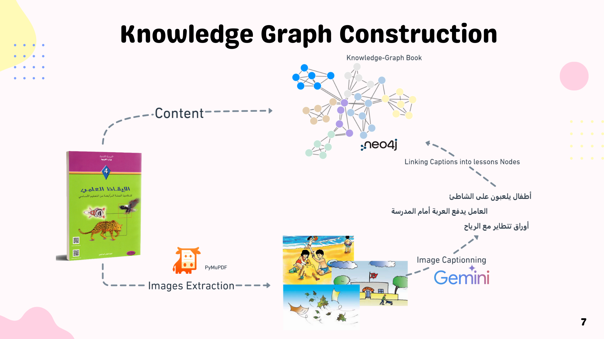

# 🎓 Etude.AI – Intelligent Multi-Agent Educational Platform

<div align="center">

**AI-Powered Educational Assistant for Tunisian Primary Students**

[](https://www.python.org/downloads/)
[](https://spring.io/projects/spring-boot)
[](https://angular.io/)
[](https://www.docker.com/)
[](LICENSE)

</div>

---

## 📋 Table of Contents

- [Overview](#-overview)
- [Architecture & Design Patterns](#-architecture--design-patterns)
- [Technology Stack](#-technology-stack)
- [System Architecture](#-system-architecture)
- [Quick Start](#-quick-start)
- [Detailed Setup](#-detailed-setup)
- [Project Structure](#-project-structure)
- [API Documentation](#-api-documentation)
- [Deployment](#-deployment)
- [Troubleshooting](#-troubleshooting)

---

## 🎯 Overview

Etude.AI is an **advanced AI-driven educational platform** that leverages multi-agent systems, knowledge graphs, and vector databases to provide personalized learning experiences for Tunisian primary school students. The system supports:

- 📚 **Intelligent Lesson Summaries** – Context-aware, culturally adapted content in Tunisian dialect
- 💬 **Interactive Q&A System** – Natural language question answering with source attribution
- 📝 **Adaptive Quiz Generation** – Auto-generated assessments based on learning progress
- 📊 **Comprehensive Session Reports** – PDF reports with learning analytics for parents
- 🎯 **Personalized Learning Paths** – AI-driven session planning based on student history

### Key Features

- **Multi-Agent AI System**: 4 specialized agents (Summary, Q&A, Quiz, Feedback) + 3 planning agents
- **Hybrid Knowledge Retrieval**: Neo4j graph database + Qdrant vector search for optimal context
- **Arabic/Tunisian Dialect Support**: Full RTL support with culturally adapted responses
- **Automatic Database Initialization**: Zero-config startup with pre-populated knowledge base
- **Microservices Architecture**: Scalable, containerized deployment with health monitoring
- **OAuth2/Keycloak Integration**: Secure authentication and user management

> **🐳 Docker-First Architecture:** This project runs entirely in Docker with **automatic database initialization**!
> - **Quick Start**: `cd backend && docker-compose --env-file ../.env up --build -d`


---

## 🏗 Architecture & Design Patterns

### Design Patterns Implemented

| Pattern | Implementation | Purpose |
|---------|---------------|---------|
| **Multi-Agent System** | CrewAI framework with 7 specialized agents | Decompose complex educational tasks into agent responsibilities |
| **Repository Pattern** | Spring Data JPA repositories | Abstract data access layer for clean architecture |
| **Dependency Injection** | Spring IoC Container | Loose coupling and testability |
| **Circuit Breaker** | Custom implementation with timeout/retry | Resilience for external service calls (LLM, databases) |
| **Factory Pattern** | Agent and tool factories | Dynamic agent creation with different configurations |
| **Strategy Pattern** | Multiple retrieval strategies (vector, graph) | Flexible knowledge retrieval based on query type |
| **Observer Pattern** | Session memory logging | Track user interactions across the session |
| **Builder Pattern** | PDF report generation | Complex document assembly with fluent interface |
| **Adapter Pattern** | Database connection wrappers | Uniform interface for Neo4j, Qdrant, Redis |
| **Singleton Pattern** | Global memory, agent instances | Single source of truth for session state |
| **Decorator Pattern** | Logging aspects (AOP) | Non-invasive cross-cutting concerns |
| **Gateway Pattern** | Nginx reverse proxy | Single entry point for all services |

### Architectural Principles

- **Microservices**: Independently deployable services (AI Pipeline, Backend, Frontend)
- **Event-Driven**: Asynchronous task processing with queuing
- **CQRS Light**: Separate read/write paths for knowledge retrieval
- **Domain-Driven Design**: Clear bounded contexts (Education, User Management, Reporting)
- **Clean Architecture**: Dependency inversion with core domain isolated from infrastructure

---

---

## 🛠 Technology Stack

### Core Technologies

| Technology | Version | Purpose | Why This Choice |
|------------|---------|---------|-----------------|
| **Python** | 3.11+ | AI Pipeline runtime | Excellent ML/AI ecosystem, async support |
| **FastAPI** | 0.120.0 | REST API framework | High performance, automatic OpenAPI docs, async native |
| **CrewAI** | 0.203.1 | Multi-agent orchestration | Simplified agent coordination with role-based design |
| **LangChain** | 0.3.27 | LLM framework | Chain abstraction, tool integration, memory management |
| **Neo4j** | 5.15.0 | Graph database | Knowledge graph queries, relationship traversal |
| **Qdrant** | v1.7.4 | Vector database | High-performance semantic search, hybrid search |
| **Redis** | 7-alpine | Cache & sessions | Embedding cache, rate limiting, session store |
| **PostgreSQL** | 15 | Relational database | User data, sessions, gamification scores |
| **Spring Boot** | 3.5.7 | Backend framework | Enterprise-grade, production-ready, extensive ecosystem |
| **Angular** | 19.2 | Frontend framework | Modern SPA, TypeScript, reactive forms |
| **Keycloak** | 24.0.2 | Identity provider | OAuth2/OIDC, SSO, user federation |
| **Nginx** | Latest | Reverse proxy | Load balancing, SSL termination, static content |
| **Docker** | Latest | Containerization | Consistent environments, easy deployment |
| **Kubernetes** | 1.28+ | Orchestration | Scaling, self-healing, rolling updates |

### AI & ML Libraries

| Library | Version | Purpose |
|---------|---------|---------|
| **google-generativeai** | 0.8.5 | Gemini API client for LLM inference |
| **langchain-google-genai** | 2.0.10 | LangChain integration for Gemini models |
| **langchain-huggingface** | 0.3.1 | HuggingFace embeddings for Arabic text |
| **qdrant-client** | 1.15.1 | Vector similarity search |
| **neo4j** | 6.0.2 | Graph database driver |
| **litellm** | Latest | Unified LLM API wrapper (supports 100+ models) |
| **crewai-tools** | 0.75.0 | Pre-built tools for agent workflows |

### Data Processing & NLP

| Library | Purpose |
|---------|---------|
| **arabic-reshaper** | Reshape Arabic text for correct rendering |
| **python-bidi** | BiDi algorithm for RTL text layout |
| **pandas** | Data manipulation for analytics |
| **PyMuPDF** | PDF text/image extraction |
| **Pillow** | Image processing for reports |
| **ReportLab** | PDF generation with Arabic support |

### Backend (Spring Boot)

| Dependency | Purpose |
|------------|---------|
| **spring-boot-starter-web** | RESTful web services |
| **spring-boot-starter-data-jpa** | ORM with PostgreSQL |
| **spring-boot-starter-data-redis** | Redis integration |
| **spring-boot-starter-security** | Security framework |
| **spring-boot-starter-oauth2-resource-server** | OAuth2 JWT validation |
| **spring-boot-starter-cache** | Caching abstraction |
| **spring-boot-starter-aop** | Aspect-oriented programming (logging, metrics) |
| **spring-boot-starter-validation** | Bean validation |
| **spring-boot-starter-websocket** | WebSocket support for real-time features |
| **keycloak-admin-client** | Keycloak management API |
| **springdoc-openapi** | Swagger/OpenAPI documentation |
| **lombok** | Boilerplate code reduction |
| **postgresql** | PostgreSQL JDBC driver |
| **Sentry** | Error tracking and monitoring |
| **Prometheus** | Metrics collection |

### Frontend (Angular)

| Package | Purpose |
|---------|---------|
| **@angular/core** | Core framework |
| **@angular/router** | SPA routing |
| **@angular/forms** | Reactive forms |
| **keycloak-angular** | Keycloak integration |
| **@fortawesome/fontawesome-free** | Icon library |
| **material-design-icons** | Google Material icons |
| **rxjs** | Reactive programming |

### DevOps & Monitoring

| Tool | Purpose |
|------|---------|
| **Docker Compose** | Local development orchestration |
| **Prometheus** | Metrics collection and alerting |
| **Grafana** | Metrics visualization dashboards |
| **Sentry** | Real-time error tracking |
| **structlog** | Structured logging (JSON) |
| **slowapi** | Rate limiting for API endpoints |

---

## 🏛 System Architecture


### High-Level Architecture

```
┌─────────────────────────────────────────────────────────────────┐
│                         NGINX Gateway                           │
│                    (Port 8080 - API Gateway)                    │
└────────────┬────────────────────────────────┬───────────────────┘
             │                                │
             v                                v
┌────────────────────────────┐    ┌────────────────────────────┐
│     Spring Boot Backend    │    │    Angular Frontend SPA    │
│      (Port 8081)           │    │       (Port 4200)          │
│                            │    │                            │
│  • OAuth2 Resource Server  │    │  • Keycloak Integration    │
│  • JPA/PostgreSQL          │    │  • Material Design         │
│  • Redis Cache             │    │  • Reactive Forms          │
│  • AI Pipeline Proxy       │    │  • PWA Support             │
│  • WebSocket Server        │    └────────────────────────────┘
└──────────┬─────────────────┘
           │
           v
┌──────────────────────────────────────────────────────────────┐
│                    AI Pipeline (FastAPI)                     │
│                        (Port 8000)                           │
│                                                              │
│  ┌───────────────────────────────────────────────────────┐   │
│  │              Multi-Agent System (CrewAI)              │   │
│  │                                                       │   │
│  │  ┌──────────┐  ┌──────────┐  ┌──────────┐  ┌────────┐ │   │
│  │  │ Summary  │  │   Q&A    │  │  Quiz    │  │Feedback│ │   │
│  │  │  Agent   │  │  Agent   │  │  Agent   │  │ Agent  │ │   │
│  │  └────┬─────┘  └────┬─────┘  └────┬─────┘  └────┬───┘ │   │
│  │       │             │             │             │     │   │
│  │       └─────────────┴─────────────┴─────────────┘     │   │
│  │                          │                            │   │
│  │                          v                            │   │
│  │             ┌─────────────────────────┐               │   │
│  │             │  Retrieval Orchestrator │               │   │
│  │             └───────────┬─────────────┘               │   │
│  └─────────────────────────┼─────────────────────────────┘   │
└────────────────────────────┼─────────────────────────────────┘
                             │
           ┌─────────────────┼──────────────┐
           │                 │              │
           v                 v              v
    ┌──────────┐      ┌──────────┐     ┌──────────┐
    │  Neo4j   │      │  Qdrant  │     │  Redis   │
    │  (Graph  │      │ (Vector  │     │ (Cache)  │
    │   DB)    │      │   DB)    │     │          │
    │          │      │          │     │          │
    │ Port 7687│      │Port 6333 │     │Port 6379 │
    └──────────┘      └──────────┘     └──────────┘
```

### Component Responsibilities

#### 1. **Frontend (Angular SPA)**
- User interface for students and parents
- Keycloak SSO integration
- Real-time session state management
- Responsive design for mobile/tablet

#### 2. **Backend (Spring Boot)**
- REST API for user management
- Session tracking and gamification
- PostgreSQL persistence
- WebSocket for real-time notifications
- OAuth2 JWT validation
- AI Pipeline integration via HTTP client

#### 3. **AI Pipeline (FastAPI + CrewAI)**
- Multi-agent orchestration
- Knowledge graph queries (Neo4j)
- Vector similarity search (Qdrant)
- LLM inference (Gemini via OpenRouter)
- PDF report generation
- Embedding caching (Redis)

#### 4. **Databases**
- **Neo4j**: Educational knowledge graph (books → branches → topics → lessons)
- **Qdrant**: Semantic search over lesson chunks (1024-dim embeddings)
- **PostgreSQL**: User accounts, sessions, progress tracking
- **Redis**: Embedding cache (7-day TTL), rate limiting, session store

#### 5. **Identity Provider (Keycloak)**
- User authentication (OAuth2/OIDC)
- Role-based access control (Student, Parent, Admin)
- User federation
- SSO across services

#### 6. **Gateway (Nginx)**
- Reverse proxy for all services
- SSL termination
- Load balancing
- Static asset serving
- CORS handling

---

## 🚀 Quick Start

### Prerequisites

- **Docker Desktop** (Windows/Mac) or **Docker Engine** (Linux)
- **Git** for cloning the repository
- **8GB RAM** minimum (16GB recommended for all services)
- **20GB free disk space**

### One-Command Setup

```bash
# 1. Clone repository
git clone https://github.com/yourusername/etude-ai.git
cd etude-ai

# 2. Configure environment
cp .env.example .env
# Edit .env with your API keys (see below)

# 3. Start all services
cd backend
docker-compose --env-file ../.env up --build -d

# 4. Wait for initialization (first run: ~3-5 minutes)
docker-compose --env-file ../.env logs -f ai-pipeline

# 5. Access the application
# - Frontend: http://localhost:8080
# - Backend API: http://localhost:8081
# - AI Pipeline: http://localhost:8000
# - Neo4j Browser: http://localhost:7474
# - Qdrant Dashboard: http://localhost:6333/dashboard
```

### Environment Configuration

Edit `.env` with your credentials:

```bash
# Required API Keys
GEMINI_API_KEY=your_gemini_api_key_here
LLM_API_KEY=your_openrouter_api_key_here
MISTRAL_API_KEY=your_mistral_api_key_here  # For embeddings

# Database Passwords (Docker internal - set strong passwords)
NEO4J_PASSWORD=your_secure_neo4j_password
POSTGRES_PASSWORD=your_secure_postgres_password

# Optional: Leave empty for Docker (no auth needed)
QDRANT_API_KEY=

# Optional: Error tracking
SENTRY_DSN=your_sentry_dsn  # Leave empty to disable
```

### Verify Installation

```bash
# Check all services are healthy
docker-compose --env-file ../.env ps

# Test AI Pipeline
curl http://localhost:8000/health

# Test Backend
curl http://localhost:8081/actuator/health

# Check databases populated
curl http://localhost:6333/collections/etudeai | grep points_count
# Should show: "points_count": 2500+
```
###  Kubernetes Deployment

```bash
# 1. Prerequisites
- Kubernetes cluster (1.28+)
- kubectl configured
- 32GB+ cluster capacity
- Persistent volume provisioner

# 2. Create namespace and secrets
kubectl apply -f k8s/00-namespace.yaml
cp k8s/01-secrets.yaml.template k8s/01-secrets.yaml
# Edit secrets with your values
kubectl apply -f k8s/01-secrets.yaml

# 3. Deploy infrastructure (Neo4j, Qdrant, PostgreSQL, etc.)
kubectl apply -f k8s/02-infrastructure.yaml

# 4. Wait for infrastructure ready
kubectl get pods -n etude-ai -w
# Wait until all pods show Running + Ready

# 5. Deploy application
kubectl apply -f k8s/03-ai-pipeline.yaml
kubectl apply -f k8s/04-backend.yaml
kubectl apply -f k8s/05-frontend.yaml
kubectl apply -f k8s/06-ingress.yaml

# 6. Verify deployment
kubectl get all -n etude-ai
kubectl logs -n etude-ai -l app=ai-pipeline -f

# 7. Port-forward for local access (development)
kubectl port-forward -n etude-ai svc/ai-pipeline 8000:8000
kubectl port-forward -n etude-ai svc/neo4j 7474:7474
```
## 📁 Project Structure

```
Etude.AI/
├── 📂 AI Pipeline/                    # Python FastAPI AI service
│   ├── 📂 app/                        # Main application code
│   │   ├── app.py                     # FastAPI app + HTTP endpoints
│   │   ├── handlers.py                # Business logic orchestration
│   │   ├── helpers.py                 # Utilities (embedding, RTL, JSON)
│   │   ├── models.py                  # Pydantic models
│   │   ├── runtime.py                 # Global agents, tools, memory
│   │   ├── pdf_report.py              # PDF generation with Arabic
│   │   ├── circuit_breaker.py         # Resilience pattern
│   │   ├── embedding_cache.py         # Redis caching for embeddings
│   │   ├── memory_manager.py          # Session state management
│   │   ├── sentry_config.py           # Error tracking
│   │   ├── exceptions.py              # Custom exceptions
│   │   └── 📂 crew/                   # CrewAI multi-agent system
│   │       ├── agents.py              # Agent definitions (4 main agents)
│   │       ├── planner_crew.py        # Planning agents (3 agents)
│   │       ├── tasks.py               # Agent task templates
│   │       ├── tools.py               # Custom tools (Neo4j retriever)
│   │       ├── knowledge_graph.py     # Neo4j wrapper
│   │       ├── run.py                 # CLI runner for planner
│   │       └── 📂 config/             # YAML configurations
│   │           ├── agents.yaml        # Planner agent configs
│   │           └── tasks.yaml         # Planner task configs
│   ├── 📂 databases_construction/     # Database initialization scripts
│   │   ├── kg_construction.py         # Neo4j knowledge graph builder
│   │   ├── Qdrant_database_construction.py  # Qdrant vector index
│   │   ├── ocr_pdf.py                 # PDF text/image extraction
│   │   └── __init__.py
│   ├── 📂 config_files/               # Educational content
│   │   ├── Book.pdf                   # Source textbook (Tunisian science)
│   │   ├── NotoNaskhArabic-Regular.ttf # Arabic font
│   │   ├── captions_ar (1).csv        # Image captions
│   │   ├── 📂 book_images/            # Extracted images (page_X_img_Y.jpeg)
│   │   └── 📂 ktebjson/               # Preprocessed JSON chunks
│   │       └── Book.pdf.json          # Page-level text chunks
│   ├── 📂 lessons/                    # Generated lesson scripts (JSON)
│   ├── 📂 reports/                    # Generated PDF reports
│   ├── 📂 tests/                      # Unit and integration tests
│   ├── check_and_populate_databases.py # Automatic DB initialization
│   ├── fix_qdrant_population.py       # Manual Qdrant population script
│   ├── docker-entrypoint.sh           # Container startup script
│   ├── Dockerfile                     # AI Pipeline container image
│   ├── requirements.txt               # Python dependencies
│   ├── main.py                        # Development entry point
│   └── pytest.ini                     # Test configuration
│
├── 📂 backend/                        # Spring Boot backend
│   ├── 📂 src/main/java/com/example/EtudeAI/
│   │   ├── EtudeAiApplication.java    # Spring Boot main class
│   │   ├── 📂 Controller/             # REST controllers
│   │   │   ├── AiController.java      # AI Pipeline proxy
│   │   │   ├── UserController.java    # User management
│   │   │   └── SessionController.java # Session tracking
│   │   ├── 📂 service/                # Business logic
│   │   │   ├── AiPipelineService.java # HTTP client for AI Pipeline
│   │   │   ├── UserService.java       # User CRUD
│   │   │   ├── SessionService.java    # Session management
│   │   │   └── GamificationService.java # Points/badges
│   │   ├── 📂 model/                  # JPA entities
│   │   ├── 📂 repository/             # Spring Data repositories
│   │   ├── 📂 config/                 # Spring configuration
│   │   │   ├── SecurityConfig.java    # OAuth2 security
│   │   │   ├── KeycloakConfig.java    # Keycloak integration
│   │   │   └── WebConfig.java         # CORS, interceptors
│   │   ├── 📂 aspect/                 # AOP aspects (logging, metrics)
│   │   ├── 📂 exception/              # Exception handlers
│   │   └── 📂 util/                   # Utility classes
│   ├── 📂 src/main/resources/
│   │   ├── application.properties     # Spring Boot config
│   │   ├── application-dev.properties # Dev profile
│   │   └── application-prod.properties # Production profile
│   ├── 📂 ops/                        # Docker configurations
│   │   ├── 📂 postgres/               # PostgreSQL init scripts
│   │   ├── 📂 keycloak/               # Keycloak realm export
│   │   ├── 📂 grafana/                # Grafana dashboards
│   │   └── 📂 prometheus/             # Prometheus config
│   ├── docker-compose.yml             # Development orchestration
│   ├── Dockerfile                     # Backend container image
│   ├── pom.xml                        # Maven dependencies
│   └── mvnw                           # Maven wrapper
│
├── 📂 frontend/                       # Angular SPA
│   ├── 📂 src/
│   │   ├── 📂 app/                    # Angular modules/components
│   │   │   ├── 📂 core/               # Core module (auth, guards)
│   │   │   ├── 📂 shared/             # Shared components
│   │   │   ├── 📂 features/           # Feature modules
│   │   │   │   ├── lesson/            # Lesson display
│   │   │   │   ├── quiz/              # Quiz interface
│   │   │   │   ├── chat/              # Q&A chat
│   │   │   │   └── report/            # Session reports
│   │   │   ├── app.component.ts       # Root component
│   │   │   └── app.routes.ts          # Routing configuration
│   │   ├── 📂 assets/                 # Static assets
│   │   ├── 📂 environments/           # Environment configs
│   │   ├── index.html                 # HTML template
│   │   ├── main.ts                    # Bootstrap
│   │   └── styles.css                 # Global styles
│   ├── angular.json                   # Angular CLI config
│   ├── package.json                   # npm dependencies
│   ├── tsconfig.json                  # TypeScript config
│   └── Dockerfile                     # Frontend container image
│
├── 📂 gateway/                        # Nginx reverse proxy
│   ├── nginx.conf                     # Nginx configuration
│   └── Dockerfile                     # Gateway container image
│
├── 📂 k8s/                            # Kubernetes manifests
│   ├── 00-namespace.yaml              # Namespace definition
│   ├── 01-secrets.yaml.template       # Secrets template
│   ├── 02-infrastructure.yaml         # Databases, Keycloak
│   ├── 03-ai-pipeline.yaml            # AI Pipeline deployment
│   ├── 04-backend.yaml                # Backend deployment
│   ├── 05-frontend.yaml               # Frontend deployment
│   ├── 06-ingress.yaml                # Ingress rules
│   └── 07-monitoring.yaml             # Prometheus, Grafana
│
├── 📄 .env.example                    # Environment template
├── 📄 .gitignore                      # Git ignore rules
├── 📄 README.md                       # This file
├── 📄 DOCKER_DATABASE_INIT.md         # Docker setup guide
├── 📄 K8S_DATABASE_MIGRATION.md       # Kubernetes guide
├── 📄 MIGRATION_SUMMARY.md            # Cloud to Docker migration
└── 📄 deploy-to-k8s.ps1              # PowerShell deployment script
```

---

## 🔌 API Documentation

### AI Pipeline Endpoints

**Base URL**: `http://localhost:8000`

| Endpoint | Method | Description | Request Body | Response |
|----------|--------|-------------|--------------|----------|
| `/health` | GET | Health check | - | `{"status": "healthy"}` |
| `/readiness` | GET | Readiness probe (checks DB connections) | - | `{"neo4j": "connected", "qdrant": "connected", "redis": "connected"}` |
| `/metrics` | GET | Prometheus metrics | - | Prometheus format |
| `/summary` | POST | Generate lesson summary with slides | `{"module": "الزمن", "subject": "فيزياء"}` | `{"title": "...", "slides": [{...}]}` |
| `/qa` | POST | Answer student question | `{"question": "ما هي الساعة؟", "module": "الزمن"}` | `{"answer": "...", "sources": [...]}` |
| `/quiz` | POST | Generate quiz questions | `{"module": "الزمن", "num_mc": 6, "num_tf": 4}` | `{"questions": [{...}]}` |
| `/report` | POST | Generate PDF session report | `{"session_id": "uuid"}` | PDF file download |
| `/lessons/{filename}` | GET | Retrieve generated lesson JSON | - | JSON lesson script |
| `/reports/{filename}` | GET | Download session report PDF | - | PDF file |

**Example: Generate Summary**

```bash
curl -X POST http://localhost:8000/summary \
  -H "Content-Type: application/json" \
  -H "X-Session-ID: 550e8400-e29b-41d4-a716-446655440000" \
  -d '{
    "module": "الزمن",
    "subject": "فيزياء"
  }'
```

**Response:**
```json
{
  "title": "درس في الوقت",
  "slides": [
    {
      "number": "1",
      "text": "أهلاً بك صغيري! اليوم نتعلمو على الوقت...",
      "image": "assets/book_images/page_45_img_0.jpeg"
    },
    {
      "number": "2",
      "text": "الثانية هي أصغر وحدة في الوقت..."
    }
  ]
}
```

### Backend API Endpoints

**Base URL**: `http://localhost:8081/api`

| Endpoint | Method | Auth | Description |
|----------|--------|------|-------------|
| `/auth/register` | POST | No | User registration |
| `/auth/login` | POST | No | Login (returns JWT) |
| `/users/me` | GET | Yes | Get current user profile |
| `/users/{id}` | GET | Yes | Get user by ID |
| `/sessions` | POST | Yes | Create learning session |
| `/sessions/{id}` | GET | Yes | Get session details |
| `/sessions/{id}/complete` | POST | Yes | Mark session complete |
| `/gamification/points` | GET | Yes | Get user points |
| `/gamification/badges` | GET | Yes | Get user badges |
| `/ai/summary` | POST | Yes | Proxy to AI Pipeline /summary |
| `/ai/qa` | POST | Yes | Proxy to AI Pipeline /qa |
| `/ai/quiz` | POST | Yes | Proxy to AI Pipeline /quiz |
| `/ai/report` | POST | Yes | Proxy to AI Pipeline /report |

**Authentication**: All protected endpoints require JWT Bearer token from Keycloak.

```bash
# 1. Get token from Keycloak
TOKEN=$(curl -X POST http://localhost:8083/auth/realms/etudeai/protocol/openid-connect/token \
  -d "client_id=etudeai-frontend" \
  -d "grant_type=password" \
  -d "username=student@example.com" \
  -d "password=password123" \
  | jq -r '.access_token')

# 2. Use token in requests
curl http://localhost:8081/api/users/me \
  -H "Authorization: Bearer $TOKEN"
```

---

## 🚢 Deployment

### Production Checklist

- [ ] Set strong passwords for all database services
- [ ] Configure proper CORS origins in `.env`
- [ ] Set up SSL certificates for all public endpoints
- [ ] Configure Sentry DSN for error tracking
- [ ] Set up Prometheus alerting rules
- [ ] Configure backup strategy for volumes
- [ ] Set resource limits in docker-compose/K8s
- [ ] Enable rate limiting on public endpoints
- [ ] Configure log retention policies
- [ ] Set up monitoring dashboards (Grafana)
- [ ] Test disaster recovery procedures
- [ ] Document operational runbooks

### Environment Variables (Production)

```bash
# Security
NEO4J_PASSWORD=<strong-password>
POSTGRES_PASSWORD=<strong-password>
KEYCLOAK_ADMIN_PASSWORD=<strong-password>

# APIs
GEMINI_API_KEY=<production-key>
LLM_API_KEY=<production-key>
MISTRAL_API_KEY=<production-key>

# Monitoring
SENTRY_DSN=https://xxx@sentry.io/xxx
SENTRY_DSN_BACKEND=https://xxx@sentry.io/xxx
ENVIRONMENT=production
RELEASE_VERSION=v1.0.0

# Feature Flags
ALLOWED_ORIGINS=https://yourdomain.com,https://app.yourdomain.com
```

### Scaling Considerations

**Horizontal Scaling** (Kubernetes):
```yaml
# Scale AI Pipeline (stateless)
replicas: 3  # Handles 3x load
````

```yaml
# Scale Backend (stateless)
replicas: 2

# Databases (vertical scaling recommended)
# Neo4j: Single instance with read replicas
# Qdrant: Sharding for large collections
# PostgreSQL: Replication for HA
```

**Performance Tuning**:
- **Redis**: Use Redis Cluster for high availability
- **Qdrant**: Enable HNSW indexing, adjust ef_construct
- **Neo4j**: Tune page cache (50% RAM), adjust heap size
- **LLM**: Implement request batching, use streaming responses

---

## 🐛 Troubleshooting

### Common Issues

#### 1. Services Won't Start

**Symptom**: `docker-compose up` fails or containers exit immediately

**Solutions**:
```bash
# Check logs
docker-compose logs <service-name>

# Common causes:
# - Missing .env file → Copy from .env.example
# - Port conflicts → Change ports in docker-compose.yml
# - Insufficient memory → Increase Docker memory (Docker Desktop settings)
# - Invalid API keys → Check .env file

# Reset everything
docker-compose down -v  # ⚠️ Deletes all data!
docker-compose up -d
```

#### 2. Databases Not Populating

**Symptom**: Qdrant shows 0 points, Neo4j has no lessons

**Solutions**:
```bash
# Check AI Pipeline logs
docker-compose logs ai-pipeline | grep -i "populate\|error"

# Manually trigger population
docker exec -it etudeai-ai-pipeline python check_and_populate_databases.py

# If rate limit errors:
# Wait 2-5 minutes, then restart
docker-compose restart ai-pipeline

# Use manual population script
docker exec -it etudeai-ai-pipeline python fix_qdrant_population.py
```

#### 3. Q&A Agent Timeout

**Symptom**: `/qa` endpoint returns 500 or timeout

**Causes**:
- Qdrant collection empty (no vectors to search)
- LLM API rate limit exceeded
- Network issues to external LLM

**Solutions**:
```bash
# Verify Qdrant has data
curl http://localhost:6333/collections/etudeai | jq '.result.points_count'
# Should be > 100

# Check embedding cache
docker exec etudeai-redis redis-cli INFO stats | grep keyspace

# Test LLM connectivity
docker exec etudeai-ai-pipeline python -c "
from app.helpers import embed
result = embed('test')
print(f'Success! Dimension: {len(result)}')
"
```

#### 4. Frontend Won't Load

**Symptom**: Browser shows blank page or 404

**Solutions**:
```bash
# Check Nginx logs
docker-compose logs gateway

# Verify backend is running
curl http://localhost:8081/actuator/health

# Check Keycloak is accessible
curl http://localhost:8083/auth/realms/etudeai/.well-known/openid-configuration

# Rebuild frontend
cd frontend
docker build -t etude-ai-frontend:latest .
```

#### 5. Neo4j Connection Refused

**Symptom**: `Failed to DNS resolve address` or `Connection refused`

**Solutions**:
```bash
# Check Neo4j is healthy
docker-compose ps neo4j
# Should show "healthy"

# Verify Neo4j logs
docker-compose logs neo4j | tail -50

# Test connection
docker exec etudeai-ai-pipeline python -c "
from neo4j import GraphDatabase
driver = GraphDatabase.driver('bolt://neo4j:7687', auth=('neo4j', 'your-password'))
driver.verify_connectivity()
print('Connected!')
"
```

### Getting Help

- **Documentation**: Check `DOCKER_DATABASE_INIT.md` and `K8S_DATABASE_MIGRATION.md`
- **Logs**: Always check logs first: `docker-compose logs -f <service>`
- **Health Checks**: Use `/health` and `/readiness` endpoints
- **GitHub Issues**: Open an issue with logs and environment details
- **Community**: Join our Discord/Slack (links in repo)
---

## 📄 License

This project is licensed under the MIT License - see the [LICENSE](LICENSE) file for details.

---

## 🤝 Contributing

We welcome contributions! Please see [CONTRIBUTING.md](CONTRIBUTING.md) for guidelines.

---

## 📧 Contact
- **Email**: contact@etude-ai.com
---

<div align="center">

**Built with ❤️ for Tunisian Students**

Made with [CrewAI](https://www.crewai.com/) • [FastAPI](https://fastapi.tiangolo.com/) • [Spring Boot](https://spring.io/projects/spring-boot) • [Angular](https://angular.io/)

</div>
  - Implemented in: `app/crew/agents.py` → `summary`  
  - Used by: `generate_summary_json` in `app/handlers.py`, exposed via `POST /summary` in `app/app.py`.

- **Q&A Agent** – Answers free-form questions from the student, using Qdrant + KG as context and a chat memory buffer.
  - Implemented in: `app/crew/agents.py` → `qa`  
  - Used by: `handle_qa` in `app/handlers.py`, exposed via `POST /qa`.

- **Quiz Agent** – Creates multiple-choice and true/false questions for a given topic and returns them as JSON.
  - Implemented in: `app/crew/agents.py` → `quiz`  
  - Used by: `generate_quiz_json` in `app/handlers.py`, exposed via `POST /quiz`.

- **Feedback Agent** – Reads the stored session data and writes a short encouraging note in Tunisian dialect.
  - Implemented in: `app/crew/agents.py` → `feedback`  
  - Used inside: `POST /report` in `app/app.py` to include the note in the PDF.

- **Session Memory** – Very light in-memory store (`SessionMemory` in `app/pdf_report.py`) wrapped as `GLOBAL_MEM` in `app/runtime.py`.  
  - Logs: summaries, Q&A history, quiz logs, feedback note, etc. for the current session.

The LLM used everywhere is Gemini (`gemini/gemini-2.0-flash`), configured in `app/crew/agents.py` and `app/crew/planner_crew.py`.

---

## Knowledge Graph & Retrieval



The educational content is built from a Tunisian science textbook and stored in two main backends: **Neo4j** and **Qdrant**.

### 1. PDF / Content Processing

Located in `databases_construction/`:

- `ocr_pdf.py`  
  - Extracts text and images from `config_files/Book.pdf` (via PyMuPDF / OCR).
  - Saves images into `config_files/book_images/`.

- `kg_construction.py`  
  - Defines a nested Python dict for branches → topics → lessons and page ranges.  
  - Writes this structure into **Neo4j** as:
    - `(:Book) -[:HAS_BRANCH]-> (:Branch)`
    - `(:Branch) -[:HAS_TOPIC]-> (:Topic)`
    - `(:Topic) -[:HAS_LESSON]-> (:Lesson)`
  - Optionally adds `(:Image)` nodes from the captions CSV and links them to lessons.
  - Computes and stores **Arabic sentence embeddings** for lessons (SBERT / HuggingFace, see imports in the file).

- `Qdrant_database_construction.py`  
  - Reads preprocessed chunks (e.g., from `config_files/ktebjson/Book.pdf.json`).  
  - Uses Gemini `"text-embedding-004"` to embed them (`embed()` inside the file).  
  - Creates / recreates the **Qdrant** collection `etudeai` and upserts points with payloads like: topic, lesson, page, text.

### 2. Runtime Retrieval

- `app/crew/knowledge_graph.py`  
  - Wraps Neo4j in `Neo4jKG`, providing:
    - `get_lessons_for_topic(topic_name)` – list of lessons + page ranges
    - `find_branch_for_topic(topic_name)` – map topic → branch
    - `fetch_all_topics()`, `fetch_all_lesson_embeddings()`, etc.

- `app/crew/tools.py`  
  - Defines `LessonRetrieverTool`, a CrewAI `BaseTool` calling `Neo4jKG.get_lessons_for_topic`.

- `app/runtime.py`  
  - Creates `TOOL = QdrantVectorSearchTool(...)` using env vars:
    - `QDRANT_URL`
    - `QDRANT_API_KEY`
    - collection `etudeai`
  - Passes this tool into `define_agents()` so **Summary / QA / Quiz** agents can retrieve semantically similar content.

---

## Planner & History Agents (Right Side of the Slide)

The planner part of your diagram is implemented in **`app/crew/planner_crew.py`** with configuration in `app/crew/config/agents.yaml` and `app/crew/config/tasks.yaml`.

### PlannerCrew

`PlannerCrew` (decorated with `@CrewBase`) wires together three agents and three tasks:

- **Agents** (`agents.yaml`):
  - `planner_agent` – “Session Management Agent”  
    - Role: propose a structured plan of sessions, using the knowledge graph through `lesson_retriever_tool`.  
  - `sessions_history_agent` – “Session History Summarizer”  
    - Role: summarize the JSON logs of past sessions.  
    - Data source: `get_sessions_logs()` from `app/handlers.py`, passed as a string knowledge source.  
  - `user_history_agent` – “User History Summarizer”  
    - Role: summarize long-term user profile and progress (strengths/weaknesses).  
    - Data source: `get_user_logs()` from `app/handlers.py`, also via `StringKnowledgeSource`.

- **Tasks** (`tasks.yaml`):
  - `sessions_history_task` – summarize past sessions in Arabic for the parent.  
  - `user_history_task` – summarize overall learning history and recommendations.  
  - `plan_task` – generate a **weekly JSON session plan** (branch, topic, lesson, date, obstacles, session_goal, parent_tip, etc.).

- **Crew entry point**:
  - `app/crew/run.py`:
    ```python
    from app.crew.planner_crew import PlannerCrew
    from app.handlers import get_parent_choices

    def run():
        inputs = get_parent_choices()
        result = PlannerCrew().crew().kickoff(inputs=inputs)
        print(result)
    ```

So the **“Planner Agent + User History Agent + Sessions History Agent”** shown on your slide are implemented exactly here.

---

## API Layer (FastAPI)

All HTTP endpoints live in `app/app.py`:

- `GET /health` – simple health check.
- `POST /summary`  
  - Body: `{ "module": "<topic name in Arabic>" }`  
  - Uses: `generate_summary_json()` → Summary agent + Neo4j KG.  
  - Saves JSON lesson script to `lessons/` directory and logs to `GLOBAL_MEM`.

- `POST /qa`  
  - Body: `{ "question": "<student question>" }`  
  - Uses: `handle_qa()` → QA agent + Qdrant + `ConversationBufferMemory`.  
  - Stores turn history in `QA_MEMORY` and appends to `GLOBAL_MEM["qa_history"]`.

- `POST /quiz`  
  - Body: `{ "module": "...", "num_mc": 6, "num_tf": 4 }`  
  - Uses: `generate_quiz_json()` → Quiz agent.  
  - Logs questions into `GLOBAL_MEM["quiz_log"]`.

- `POST /report`  
  - Reads what is stored in `GLOBAL_MEM`:
    - Chapter summaries
    - Q&A pairs
    - Quiz results  
  - Builds a multi-section Arabic prompt, calls the **Feedback Agent** to write a short note in Tunisian dialect.  
  - Calls `render_pdf()` from `app/pdf_report.py` to generate a **session report PDF** into `reports/session_report.pdf`.

Static routes:

- `/lessons` – serves JSON lesson scripts saved in `lessons/`.
- `/reports` – serves generated PDFs from `reports/`.

### PDF Rendering

- Implemented in `app/pdf_report.py`:
  - Uses ReportLab + Pillow.
  - Handles Arabic correctly with:
    - `ARABIC_FONT_NAME` & `NotoNaskhArabic-Regular.ttf` from `config_files/`.
    - `rtl()` and `strip_unsupported()` helpers from `app/helpers.py`.
  - Can also render images referenced by markdown-style `` tags using `config_files/book_images`.

---

## Project Structure

```text
Multi-Agent-Tunisian-Educational-Plateform-main/
├── app/
│   ├── app.py                # FastAPI app + HTTP endpoints
│   ├── handlers.py           # Summary / QA / Quiz orchestration, logs for planner
│   ├── helpers.py            # Gemini embedding helper, JSON cleaning, Arabic RTL utilities
│   ├── pdf_report.py         # SessionMemory + ReportLab PDF generation
│   ├── runtime.py            # Qdrant tool, shared LLM, global agents & GLOBAL_MEM
│   └── crew/
│       ├── agents.py         # Summary, QA, Quiz, Feedback agents (Gemini)
│       ├── planner_crew.py   # PlannerCrew + user/sessions history + planner agent
│       ├── run.py            # Small CLI runner for PlannerCrew
│       ├── tasks.py          # Prompt templates for summary, QA, quiz
│       ├── tools.py          # LessonRetrieverTool wrapping Neo4jKG
│       ├── knowledge_graph.py# Thin Neo4j client with helper queries
│       └── config/
│           ├── agents.yaml   # Config for planner_agent, sessions_history_agent, user_history_agent
│           └── tasks.yaml    # Config for plan_task, sessions_history_task, user_history_task
├── config_files/
│   ├── Book.pdf              # Original science textbook
│   ├── NotoNaskhArabic-Regular.ttf
│   ├── book_images/          # Extracted images
│   ├── captions_ar (1).csv   # Image captions in Arabic
│   └── ktebjson/
│       └── Book.pdf.json     # Page-level text chunks used in indexing
├── databases_construction/
│   ├── ocr_pdf.py            # Extract text + images from the PDF
│   ├── kg_construction.py    # Build Neo4j knowledge graph + lesson embeddings
│   └── Qdrant_database_construction.py  # Build Qdrant "etudeai" collection
├── lessons/                  # Auto-generated JSON lesson scripts from /summary
├── main.py                   # Dev entrypoint: starts FastAPI with Uvicorn + ngrok
├── session_report.pdf        # Example generated report
├── 6.png                     # System overview diagram
└── 7.png                     # Knowledge graph construction diagram
